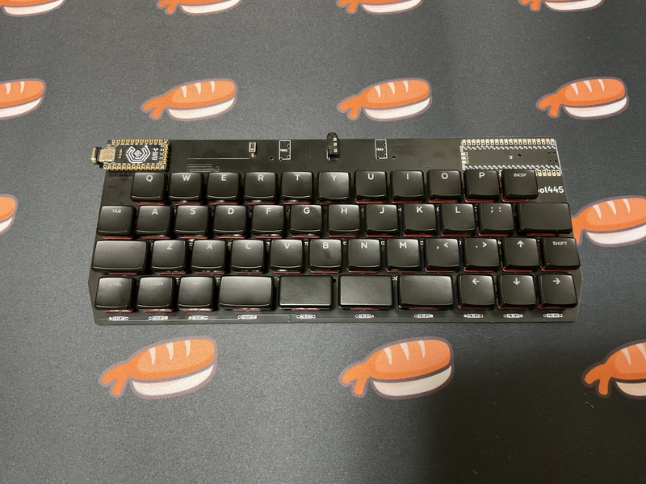

# cool445
## What is cool445？

cool445 is a 45-key keyboard.
 
The key layout is row staggered.
  
coo445は45キーのキーボードです。
 
キーレイアウトは、ロウスタッガードです。
  
You can choose either pro micro or raspberry pi pico to use.
  
pro microかraspberry pi picoのどちらか一つを選んで使うことができます。
  
You can choose either choc switch or cherry mx switch to use.
  
Chocスイッチか CHERRY MXスイッチのどちらか一つを選んで使うことができます。
 
 
It can be connected to cool450 with a TRRS cable.
 
By connecting, cool445 can use the numeric keypad macro pad.
 
You can put the cool640 on the left or right side of the cool445.
  
cool450とTRRSケーブルで繋ぐことができます。
 
繋ぐことにより、cool445はテンキーマクロパッドを使うことができます。
 
cool445の左右好きな方に、cool640を置くことができます。
 
 
It will be distributed on booth in the future, but you can freely use the data here and place an order with the PCB manufacturer.
  
将来、boothにて頒布しますが、ここにあるデータを自由に使い、各自がPCB製造元に発注しても構いません。
  
I do not take any responsibility for the data that you freely use.
 
Please use at your own risk.
  
各自が自由に使ったデータについては、私は一切の責任を負いません。
 
自己責任で利用してください。
 

## Build Guide
Preparing now.
 
ただいま準備中。

 

## Firmware
Preparing now.
 
ただいま準備中。
